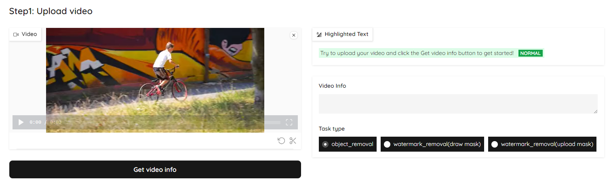
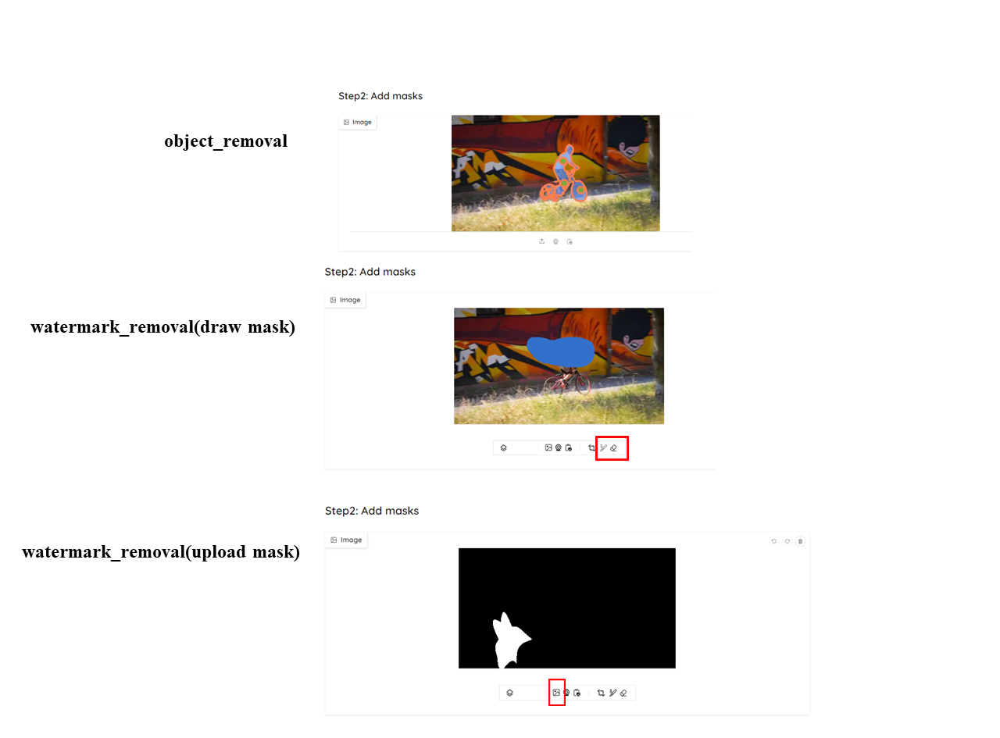
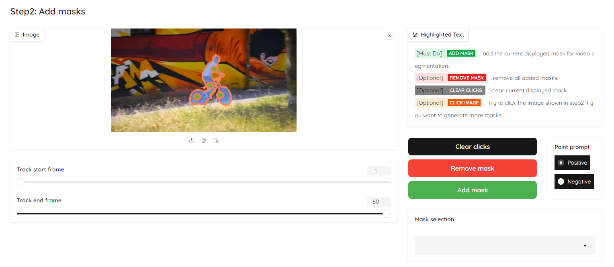
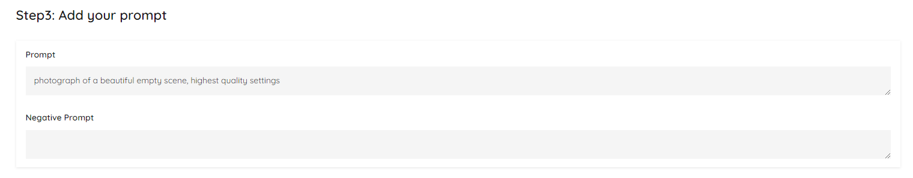
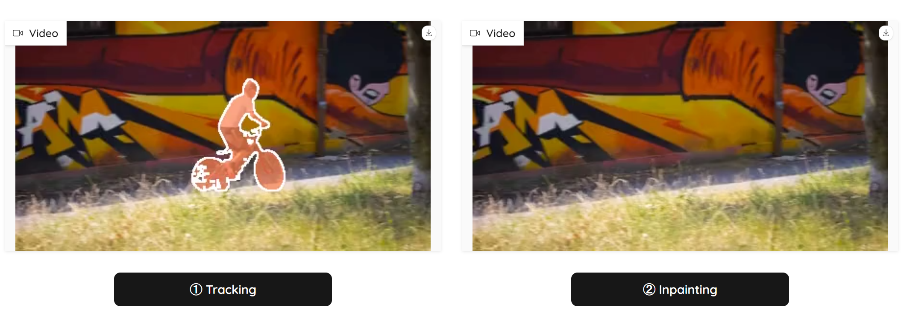

## Get Started

Install Model and Demo Dependencies
```shell
cd web-demos/hugging_face

# install python dependencies 
pip3 install -r requirements.txt

# Run the demo
python app.py
```

## Usage Guidance
* Step 1: Upload your video, choose the task type and click the `Get video info` button.
   

* Step 2: 
   1. *[Optional]* Specify the tracking period for the currently added mask by dragging the `Track start frame` or `Track end frame`.
   2. Base on different task type:
        - object_removal: Click the image on the left to select the mask area.
        - watermark_removal(draw mask): click the draw button at the bottom of the block and draw the mask.
        - watermark_removal(upload mask): click the upload button at the bottom of the block and upload the mask.
        
   3. Add the mask:
      - Click `Add mask` if you are satisfied with the mask, or
      - *[Optional]* Click `Clear clicks` if you want to reselect the mask area, or
      - *[Optional]* Click `Remove mask` to remove all masks.
      
   4. Set the text prompt
      

* Step 3: 
   1. Click the `Tracking` button to track the masks for the whole video.
   2. Then click `Inpainting` to get the inpainting results.
   

*You can always refer to the `Highlighted Text` box on the page for guidance on the next step!*


## License

This project is licensed under [NTU S-Lab License 1.0](https://github.com/sczhou/CodeFormer/blob/master/LICENSE). Redistribution and use should follow this license.


## Acknowledgements

The project harnesses the capabilities from [Propainter](https://github.com/sczhou/ProPainter), [Track Anything](https://github.com/gaomingqi/Track-Anything), 
[Segment Anything](https://github.com/facebookresearch/segment-anything) and [Cutie](https://github.com/hkchengrex/Cutie). Thanks for their awesome works.
